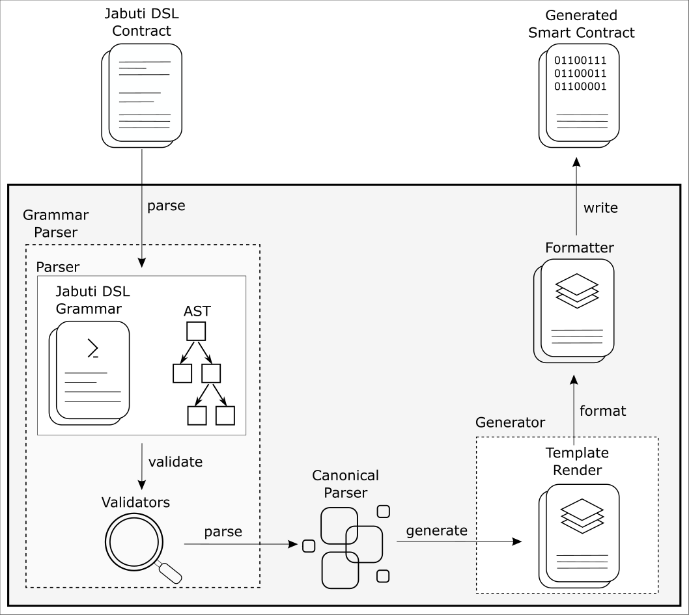

<h1 align="center">
  <br>
  
  <br>
  Jabuti CE Transformation Engine
  <br>
</h1>

<h4 align="center">A package to transform Jabuti DSL contract into other smart contract languages.</h4>

<div align="center">
  
  
  
</div>

<br>

> If you want see Jabuti DSL smart contract samples, you will find them _[here](https://github.com/gca-research-group/jabuti-ce-transformation-engine/tree/main/samples)_.

## Table of contents

- [Project papers](#project-papers)
- [Project repositories](#project-repositories)
- [Transformation engine model](#transformation-engine-model)
- [How to Execute](#how-to-execute)
- [How to Compile](#how-to-compile)

## Project papers

- [Advances in a DSL to Specify Smart Contracts for Application Integration Processes](https://sol.sbc.org.br/index.php/cibse/article/view/20962)
- [On the Need to Use Smart Contracts in Enterprise Application Integration](https://idus.us.es/handle/11441/140199)
- [Jabuti CE: A Tool for Specifying Smart Contracts in the Domain of Enterprise Application Integration](https://www.scitepress.org/Link.aspx?doi=10.5220/0012413300003645)

## Project repositories

- [Smart Contract Execution Monitoring System](https://github.com/gca-research-group/smart-contract-execution-monitoring-system)
- [Hyperledger Fabric Development Network Manager](https://github.com/gca-research-group/hyperledger-fabric-development-network-manager)
- [Transformation Engine](https://github.com/gca-research-group/jabuti-ce-transformation-engine)
- [Jabuti CE](https://github.com/gca-research-group/jabuti-ce-vscode-plugin)
- [Jabuti DSL Grammar](https://github.com/gca-research-group/jabuti-ce-jabuti-dsl-grammar)
- [Jabuti XText/Xtend implementation](https://github.com/gca-research-group/dsl-smart-contract-eai)

## Transformation engine model

The transformation engine receives the Jabuti DSL contract, processes it and converts it to the requested format. It is composed of 5 components: **Grammar Parser**, **Validators**, **Canonical Parser**, **Template Generator** and **Code Formatter**. **Grammar Parser** converts the Jabuti DSL contract into an Abstract Syntax Tree (AST). **Validators** are a set of validators responsible for syntactically and semantically evaluating the contract. **Canonical Parser** converts the AST generated by **Generic Parser** to the structure required by **Template Generator**. The **Template Generator** converts the data received from the previous component to the defined format of the desired blockchain. Finally, **Code Formatter** formats the resulting file according to the formatting rules of the target language used in the smart contract.

<div align="center">
  
</div>

## How to execute

You will find some examples at the [samples](samples) folder.

## How to Compile

- Clone this repository

```sh
git clone https://github.com/gca-research-group/jabuti-ce-jabuti-dsl-grammar
```

- Install the dependencies

```sh
npm install
```

- Compile the project

```sh
npm run build
```

- Packing the code

```sh
npm pack
```

## License

This project is licensed under the MIT License. See the [LICENSE](LICENSE) file for details.

## Contact

For any questions or issues, please open an issue on GitHub or contact the maintainers.
