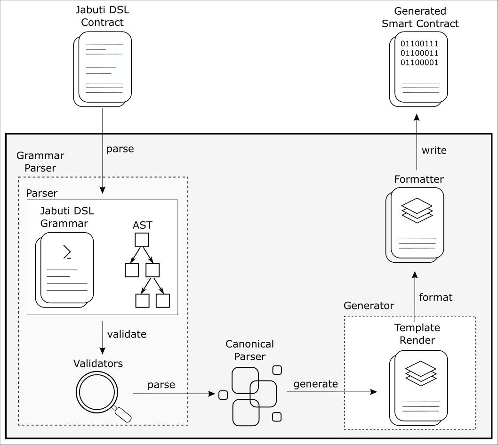

<h1 align="center">
   
  
  
   
  Jabuti CE Transformation Engine
   
</h1>

<h4 align="center">A package to transform Jabuti DSL contract into other smart contract languages.</h4>

  
  

 

## Table of content
- [Transformation engine model](#transformation-engine-model)
- [Jabuti project papers](#jabuti-project-papers)
- [Jabuti projetct repositories](#Jabuti-projetct-repositories)

## Jabuti project papers
- [Advances in a DSL to Specify Smart Contracts for Application Integration Processes](https://sol.sbc.org.br/index.php/cibse/article/view/20962)
- [On the Need to Use Smart Contracts in Enterprise Application Integration](https://idus.us.es/handle/11441/140199)
- [Jabuti CE: A Tool for Specifying Smart Contracts in the Domain of Enterprise Application Integration](https://www.scitepress.org/Link.aspx?doi=10.5220/0012413300003645)

## Jabuti projetct repositories
- VSCode based projects
  - [Jabuti DSL Grammar](https://github.com/gca-research-group/jabuti-ce-jabuti-dsl-grammar)
  - [Transformation Engine](https://github.com/gca-research-group/jabuti-ce-transformation-engine)
  - [VSCode Plugin](https://github.com/gca-research-group/jabuti-ce-vscode-plugin)
- XText based project
  - [XText/Xtend implementation](https://github.com/gca-research-group/dsl-smart-contract-eai)

## Transformation engine model
The transformation engine receives the Jabuti DSL contract, processes it and converts it to the requested format. It is composed of 5 components: **Grammar Parser**, **Validators**, **Canonical Parser**, **Template Generator** and **Code Formatter**. **Grammar Parser** converts the Jabuti DSL contract into an Abstract Syntax Tree (AST). **Validators** are a set of validators responsible for syntactically and semantically evaluating the contract. **Canonical Parser** converts the AST generated by **Generic Parser** to the structure required by **Template Generator**. The **Template Generator** converts the data received from the previous component to the defined format of the desired blockchain. Finally, **Code Formatter** formats the resulting file according to the formatting rules of the target language used in the smart contract.

  

## License

Copyright © 2023 [The Applied Computing Research Group (GCA)](https://github.com/gca-research-group). 
This project is [MIT](https://github.com/gca-research-group/jabuti-dsl-language-model-transformation/blob/master/LICENSE) licensed.
